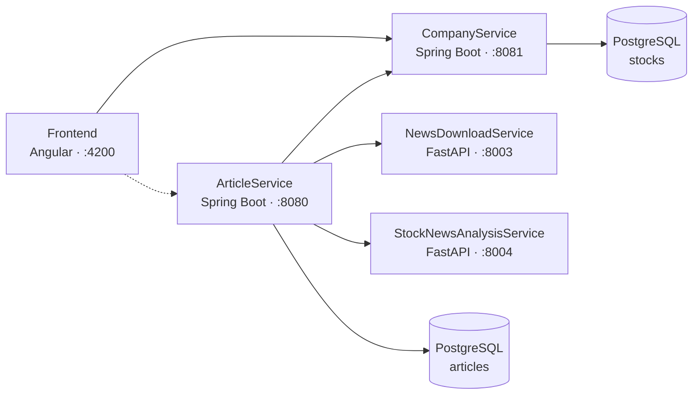

# Stock News Aggregator

A microservice-based aggregator of Polish stock market (GPW) news. It downloads
articles from financial news sources, matches them to listed companies, scores
their sentiment with an NLP model and presents everything in a web UI.

## Architecture



| Service | Tech | Port | Responsibility |
|---|---|---|---|
| [Frontend](Frontend/) | Angular 18 | 4200 | Company browser, search, admin panel, TradingView charts |
| [ArticleService](ArticleService/) | Java 17, Spring Boot | 8080 | Orchestrates article download, company matching and persistence |
| [CompanyService](CompanyService/) | Java 17, Spring Boot | 8081 | GPW company catalog, aliases, chart symbol mappings, import |
| [NewsDownloadService](NewsDownloadService/) | Python, FastAPI | 8003 | Stateless fetcher: RSS + full-text extraction with paywall detection |
| [StockNewsAnalysisService](StockNewsAnalysisService/) | Python, FastAPI | 8004 | NLP: article-to-company matching and sentiment scoring |

## Prerequisites

- Java 17+, Node.js 18+, Python 3.12+
- PostgreSQL running on `localhost:5432` with databases `articles` and `stocks`
- Python virtualenvs: in each Python service run
  `python -m venv .venv && .venv\Scripts\pip install -r requirements.txt`
  (NewsDownloadService) or `.venv\Scripts\pip install -e .` (StockNewsAnalysisService)
- Frontend dependencies: `npm install` inside `Frontend/`

## Running

Start each service in its own terminal (order matters — ArticleService calls
the Python services on startup):

```powershell
# 1. NewsDownloadService (port 8003)
cd NewsDownloadService
.venv\Scripts\python main.py

# 2. StockNewsAnalysisService (port 8004)
cd StockNewsAnalysisService
.venv\Scripts\python -m uvicorn app.main:app --host 127.0.0.1 --port 8004

# 3. CompanyService (port 8081)
cd CompanyService
.\mvnw.cmd spring-boot:run

# 4. ArticleService (port 8080)
cd ArticleService
.\mvnw.cmd spring-boot:run

# 5. Frontend (port 4200)
cd Frontend
npm start
```

Then open **http://localhost:4200**.

Useful endpoints:

- `http://localhost:8003/docs`, `http://localhost:8004/docs` — FastAPI Swagger UIs
- `http://localhost:8080/actuator/health`, `http://localhost:8081/actuator/health` — Spring health checks

The Python services also ship `Dockerfile`s and can be built with
`docker build` individually.
