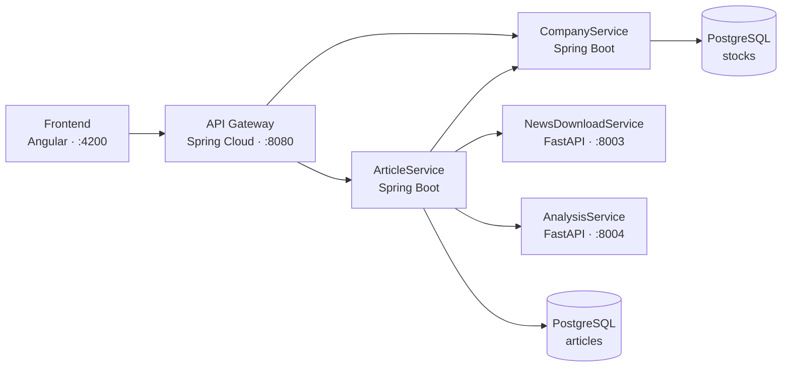

# SignalHub

Dostępne pod adresem: https://app.signalhub.pl/

Microserwisowy agregator newsów z warszawskiej giełdy (GPW). Pobiera artykuły
z serwisów finansowych, dopasowuje je do notowanych spółek, ocenia **sentyment
per spółka** modelem NLP i prezentuje całość w webowym pulpicie: indeksy,
nastrój rynku, newsy z podziałem na dobre/złe wieści i najczęściej opisywane
spółki.

> Projekt portfolio — architektura mikroserwisowa (Spring Boot + FastAPI),
> API Gateway, konteneryzacja i analiza sentymentu oparta na zero-shot NLI.

## Architektura


```mermaid
flowchart LR
    FE[Frontend<br/>Angular · :4200] --> GW[API Gateway<br/>Spring Cloud · :8080]
    GW --> AS[ArticleService<br/>Spring Boot]
    GW --> CS[CompanyService<br/>Spring Boot]
    AS --> ND[NewsDownloadService<br/>FastAPI · :8003]
    AS --> AN[AnalysisService<br/>FastAPI · :8004]
    AS --> CS
    AS --> DB[(PostgreSQL<br/>articles)]
    CS --> DB2[(PostgreSQL<br/>stocks)]
```

Gateway jest jedynym publicznym wjazdem — routuje po ścieżce
(`/api/v1/article/**` → ArticleService, `/api/v1/company*/**` → CompanyService).
Serwisy Java nie są wystawione bezpośrednio.

| Serwis | Technologia | Port | Rola |
|---|---|---|---|
| [Frontend](Frontend/) | Angular 18 | 4200 | Pulpit, przeglądarka spółek, widok artykułu |
| [Gateway](Gateway/) | Spring Cloud Gateway | 8080 | Jedyny publiczny wjazd, routing, CORS |
| [ArticleService](ArticleService/) | Java 25, Spring Boot | wewn. | Orkiestracja: pobieranie, matching, sentyment, persystencja |
| [CompanyService](CompanyService/) | Java 25, Spring Boot | wewn. | Katalog spółek GPW, aliasy, mapowania wykresów, import |
| [NewsDownloadService](NewsDownloadService/) | Python, FastAPI | 8003 | Bezstanowy fetcher: RSS + ekstrakcja treści, detekcja paywalla |
| [StockNewsAnalysisService](StockNewsAnalysisService/) | Python, FastAPI | 8004 | NLP: dopasowanie artykuł–spółka i ocena sentymentu (mDeBERTa, zero-shot) |

## Uruchomienie (Docker — zalecane)

Wymaga tylko **Dockera**. Jedno polecenie stawia cały stack (7 kontenerów
+ Postgres z bazami `articles` i `stocks`):

```bash
docker compose up --build
```

Potem otwórz **http://localhost:4200**.

> **Pierwszy build jest wolny** — serwis analizy pobiera bibliotekę torch
> i model NLP (~kilkaset MB). Kolejne uruchomienia są szybkie (cache + wolumen
> na model).

Świeży start = pusta baza. Żeby zobaczyć dane:

```bash
# import katalogu spółek GPW (endpoint importu w CompanyService)
# a następnie pobranie i analiza artykułów:
curl http://localhost:8080/api/v1/article/fetch/48
curl http://localhost:8080/api/v1/article/match
curl http://localhost:8080/api/v1/article/analyse
```

Scheduler ArticleService i tak robi ten cykl automatycznie co godzinę.

## Uruchomienie lokalne (bez Dockera, dev)

Wymaga Java 25, Node 18+, Python 3.12+ i Postgresa na `localhost:5432`
(bazy `articles`, `stocks`). Każdy serwis w osobnym terminalu — Python-y
najpierw, bo ArticleService woła je na starcie:

```powershell
cd NewsDownloadService;       .venv\Scripts\python main.py
cd StockNewsAnalysisService;  .venv\Scripts\python -m uvicorn app.main:app --host 127.0.0.1 --port 8004
cd CompanyService;            .\mvnw.cmd spring-boot:run
cd ArticleService;            .\mvnw.cmd spring-boot:run
cd Frontend;                  npm start
```

W trybie dev front (`ng serve`) woła serwisy bezpośrednio (8080/8081),
z pominięciem gatewaya. Wersja produkcyjna/Docker idzie przez gateway.

## Przydatne adresy

- `http://localhost:8003/docs`, `http://localhost:8004/docs` — Swagger UI (FastAPI)
- `http://localhost:8080/actuator/health` — health gatewaya

## Stack

Angular · Spring Boot · Spring Cloud Gateway · FastAPI · PostgreSQL ·
Docker Compose · Hugging Face Transformers (mDeBERTa, zero-shot NLI)
